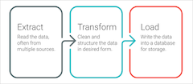
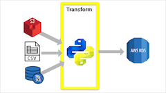

# Movies-ETL

### Overview of Project
Amazing Prime loves the dataset and wants to keep it updated on a daily basis. My colleague Britta needs my help to create an automated pipeline that takes in new data, performs the appropriate transformations, and loads the data into existing tables. I refactored the code to create one function that took in the three files—Wikipedia data, Kaggle metadata, and the MovieLens rating data—and performed the ETL process by adding the data to a PostgreSQL database.

### Project Purpose & Background
This module helped us learn how to use the Extract, Transform, Load (ETL) process to create data pipelines. A data pipeline moves data from a source to a destination, and the ETL process creates data pipelines that also transform the data along the way. The possibility of receiving data that needs to be cleaned properly and efficiently operates in our workflow is crucial to our data analysis timeline and efforts. With that understanding, the process of data extraction, data transformation, and data loading is an important process for a data analyst.

# Resources Used
- Data Source: [wikipedia-movies.json](/data/wikipedia-movies.json), [movies_metadata.csv](/data/movies_metadata.csv), [ratings.csv](/data/ratings(c).xlsb)

- Software: Python, Pandas, PostgreSQL  

**Important:** Bad data comes in three states!

- Beyond repair
- Badly damaged
- Wrong form

The state of the data largely determines which strategy you should use to clean it.

## ETL & The Iterative Process for Cleaning Data

**Extract Transform Load (ETL)**

ETL stands for extract, transofm and load. Raw data needs to be cleaned and structured before it can be analyzed. ETL represents the three phases of the process that helps us get this done.

**Extract**
- Read the data, often from multiple sources.

**Transfrom**
- Clean and structure the data in desired form.

**Load**
- Write the data into a database for storage.

### Extract
When we extract data it may be pulled from a variety of sources. The sources could be flat files, scraped webpages in HTML or JavaScript Object Notation (JSON) format, SQL tables, or even streams of sensor data. The extracted data is held in a staging area in between the data sources and data targets.
For Movies-ETL, scraped Wikipedia data that was stored as a JSON format file was extracted, as well as Kaggle data stored in the comma separated value (CSV) file format.

### Transform
Data is extracted, and may have to undergo numerous transformations until it is sufficient to glean useable information from. The goal when performing the transformation step in our overall process is to create consistent structure in the data. Without this, our analysis will be neither complete nor accurate.
For this step in the process Python and Pandas were used to explore, document, and perform the transformation of our data.

### Load
Data is transformed then it is loaded into a data target. Data targets vary depending on where we are concluding our analysis.
The target for our data was a PostgreSQL table.

